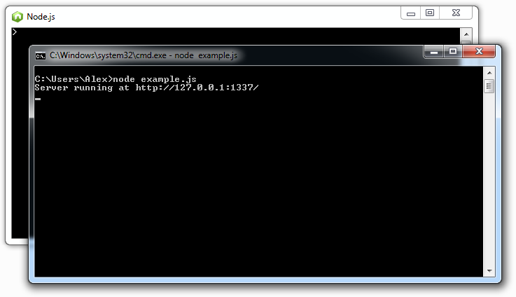
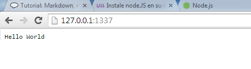

# Tutorial Node.js

##Que es node.js

>Node.js es un entorno de programaci?n en la capa del servidor basado en el lenguaje de programaci?n ECMAScript, as?ncrono, con I/O de datos en una arquitectura orientada a eventos y basado en el motor V8 de Google. 
Fue creado con el enfoque de ser ?til en la creaci?n de programas de red altamente escalables, como por ejemplo, servidores web.


##Instalacion en Win7

>Para instalar en windows simplemente habra que descargar el programa de la pagina web de [node.js], siguiendo el asistente.


##Ejemplo

>Escribiremos el siguiente fichero para probar el node.js


>###example.js

```
var http = require('http');
http.createServer(function (req, res) {
	 res.writeHead(200, {'Content-Type': 'text/plain'});
	res.end('Hello World\n');
}).listen(1337, '127.0.0.1');
console.log('Server running at http://127.0.0.1:1337/');
 ```


>Hola





Si en el explorador web accedemos a el localhost, el servidor debera respondernos con un "Hello World"





[node.js]:http://nodejs.org